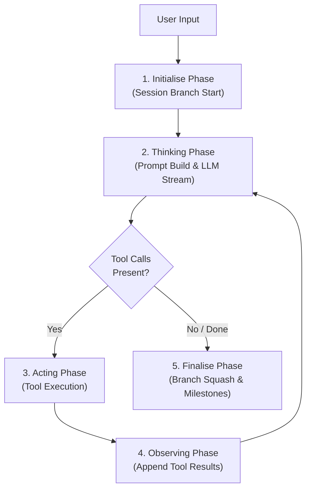

# Wayfare Architecture & Design Guidelines

This document outlines the core architectural principles, design patterns, and coding standards used across the Wayfare codebase. Follow these guidelines when extending or modifying the codebase to maintain simplicity, high readability, and effortless navigability.

---

## 1. Core Engineering Philosophy

Wayfare is designed around five foundational qualities:

1. **High Navigability & Feature Slicing**: A developer inspecting the codebase for the first time should understand the overall application lifecycle in under 30 seconds. Components are organised into clear domain slices (`Session/`, `Agent/`, `Tools/`, `Infrastructure/`, `UI/`).
2. **Composition Over Inheritance**: Data structures use flat polymorphic records (algebraic discriminated unions), and services compose focused collaborator strategies without deep class inheritance trees.
3. **100% Unit Testability**: Clean abstraction seams at I/O and external boundaries (`Microsoft.Extensions.AI.IChatClient`, `ISessionStore`, `IEventPublisher`, `IToolManager`, `IToolHelpers`) allow complete testing without real network, file system, or process invocations.
4. **Early Boundary Guards**: Public entry points validate inputs and state upfront, guaranteeing that internal methods execute in a valid state.
5. **Zero-Noise Internal Helpers**: Private helper methods perform direct, focused tasks without repetitive defensive assertions or redundant null checks.

---

## 2. Linear Data Flow Pipeline

Wayfare processes agent cycles through a strict 5-stage pipeline:



### Phase Breakdown

1. **Initialise Phase**: Receives raw user input, starts a new conversation branch in `Session`, and transitions state to `Thinking`.
2. **Thinking Phase**: Constructs `SessionMessage` prompts from session history, maps them to `Microsoft.Extensions.AI.ChatMessage`, streams tokens and reasoning tokens from the LLM (`IChatClient`), and assembles content or `ToolCall` requests.
3. **Acting Phase**: Dispatches tool invocations in parallel to `ITool` instances registered in `ToolManager`.
4. **Observing Phase**: Records tool execution results (`ToolExecutionResult`) back into the `Session` AST and loops back to `Thinking`.
5. **Finalise Phase**: Squashes completed branch turns into a concise STARL milestone (`BranchSquasher`) and emits a `CycleCompletedEvent`.

---

## 3. Solution Structure

```
Wayfare/
├── Program.cs                                 // Composition root & top-level REPL loop
├── Infrastructure/
│   ├── Configuration/Settings.cs              // Environment configuration & validation
│   ├── AI/                                    // MEAI streaming contracts, mappers & reasoning content
│   │   ├── ChatModels.cs                      // ToolCall DTO
│   │   ├── ReasoningContent.cs                // AIContent representation for reasoning tokens
│   │   ├── SessionMessageMapper.cs            // SessionMessage to ChatMessage converter
│   │   └── ToolMapper.cs                      // ITool to AIFunction / AITool mapper
│   ├── Clients/                               // Chat client decorators & adapters
│   │   └── ReasoningExtractionChatClient.cs   // DelegatingChatClient for OpenAI reasoning extraction
│   └── Events/                                // Channel-based event broker & event records
│       ├── Events.cs
│       └── EventBroker.cs
├── Session/                                   // In-memory AST, turns, and async disk persistence
│   ├── ISession.cs
│   ├── Session.cs
│   ├── SessionModels.cs
│   └── SessionStore.cs
├── Tools/                                     // Dynamic Roslyn compiler & built-in tool plugins
│   ├── ITool.cs
│   ├── ToolManager.cs
│   ├── ToolHelpers.cs
│   └── Implementations/
│       ├── InspectMilestoneTool.cs
│       ├── ExecuteCommandTool.cs
│       ├── FindTool.cs
│       ├── ListTool.cs
│       ├── ReadFileTool.cs
│       ├── ReplaceTool.cs
│       └── WriteFileTool.cs
├── Agent/                                     // 5-phase orchestration pipeline & prompt builders
│   ├── AgentModels.cs
│   ├── Orchestrator.cs
│   ├── IntentResolver.cs
│   ├── PivotDetector.cs
│   ├── BranchSquasher.cs
│   ├── CircuitBreaker.cs                      // Loop detection & repetition breaker strategy
│   └── Prompts.cs
└── UI/                                        // Solarpunk terminal interface & Spectre renderers
    ├── ITerminalUI.cs
    ├── TerminalUI.cs
    ├── ColourPalette.cs
    └── Components/
        ├── MarkdownStreamRenderer.cs
        ├── ProgressRenderer.cs
        └── ThinkingStreamRenderer.cs
```

---

## 4. Early Boundary Guards Pattern

Place all argument validation and state invariant checks as far up the call stack as possible—at public API entry points.

### Guidelines

- Use standard .NET guard methods (`ArgumentException.ThrowIfNullOrWhiteSpace`, `ArgumentNullException.ThrowIfNull`).
- Throw explicit exceptions (`InvalidOperationException`, `ArgumentException`) immediately when preconditions are violated.
- Never let invalid states pass by quietly or fail silently.

---

## 5. Zero-Noise Helper Methods

Because public boundary methods guarantee valid state, private internal helpers should assume valid invariants.

### Guidelines

- Keep private helper methods short (5–15 lines).
- Avoid repeating defensive checks (`if (obj != null)` or type assertions) inside helpers when upper layers already validated them.
- Use C# pattern-matching expressions and LINQ for clear, declarative transformations.

---

## 6. Null Safety & Error Reporting Standards

### Null Safety Rules

- Avoid unnecessary `string?` parameters or record properties.
- Use default empty string values (`string Path = ""`, `string Command = ""`) in DTOs and argument records.
- Prefer non-nullable collection types (`IReadOnlyList<string>`, `HashSet<string>`).

### Error Reporting Standards

- **Fail-Fast Startup**: If application configuration (`Settings`) or tool loading (`ToolManager`) fails during startup, print detailed diagnostic messages to `Console.Error` and exit immediately with a non-zero exit code.
- **Never Pass Quietly**: Never swallow exceptions silently or return dummy fallback values when an invalid state occurs.

---

## 7. Dynamic Tool Engineering (`ITool`)

Tools in Wayfare are self-contained plugins implementing `ITool`.

### Tool Guidelines

1. **Sealed Classes**: Implement tools as `internal sealed class ToolName(IToolHelpers toolHelpers) : ITool`.
2. **Safe Invocation Messages**: `GetInvocationMessage(string arguments)` must be non-throwing. Format display arguments safely using null-coalescing defaults if argument parsing fails.
3. **Structured Results**: Return clean `ToolExecutionResult` instances indicating success, display messages, output strings, and explicit error details.
