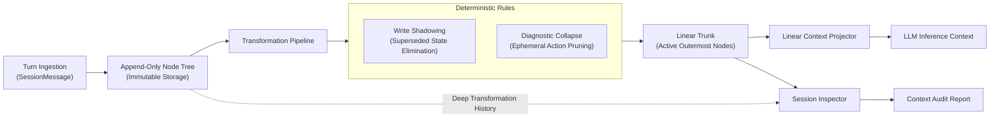

# Wayfare System Architecture & Execution Blueprint

This document defines the architectural structure, component layout, context ledger lifecycle, and agent execution pipeline for the Wayfare codebase.

---

## 1. Solution Structure

Wayfare is organised into distinct vertical domain slices:

```
Wayfare/
├── Program.cs                                 // Composition root & top-level REPL loop
├── Agent/                                     // 5-stage loop, prompt builder, branch squashing
│   ├── AgentModels.cs                         // Agent interfaces & contract definitions
│   ├── Orchestrator.cs                        // Core agent execution cycle & post-squash audit report
│   ├── BranchSquasher.cs                      // STARL + Key Artifacts milestone compressor
│   ├── Prompts.cs                             // Message prompt builder using ISessionProjector
│   ├── PivotDetector.cs                       // User intent pivot detection
│   └── CircuitBreaker.cs                      // Loop detection & repetition breaker guards
├── Session/                                   // Immutable Context Ledger, Transformations & Projection
│   ├── ISession.cs                            // Session contract with LinearTrunk & Pipeline
│   ├── Session.cs                             // In-memory ledger coordinator
│   ├── SessionModels.cs                       // HistoryNode polymorphic hierarchy & SessionMessages
│   ├── SessionStore.cs                        // Channel-backed async disk persistence
│   ├── Transformations/                       // Deterministic Transformation Pipeline
│   │   ├── ITransformationPipeline.cs         // Pipeline and rule contracts
│   │   ├── TransformationPipeline.cs          // Sequential rule coordinator
│   │   ├── ResourceIndex.cs                   // Resource access index and extraction
│   │   ├── WriteShadowingRule.cs              // Superseded state elimination
│   │   └── DiagnosticCollapseRule.cs          // Ephemeral exploratory action pruning
│   ├── Projection/                            // Context projection for LLM inference
│   │   └── SessionProjector.cs                // Linear trunk context projector
│   └── Inspection/                            // Observability & transformation history traversal
│       └── SessionInspector.cs                // Recursive lineage unwrapping & audit metrics
├── Tools/                                     // Tool interfaces, manager, and built-ins
│   ├── ITool.cs                               // Tool interfaces, schema, and execution results
│   ├── ToolManager.cs                         // Dynamic Roslyn tool compilation and registry
│   ├── ToolHelpers.cs                         // Path sanitisation, ignore filters, argument parsing
│   └── Implementations/                       // Core tools (read, write, replace, find, list, execute, inspect)
│       ├── ExecuteCommandTool.cs
│       ├── FindTool.cs
│       ├── InspectMilestoneTool.cs            // Inspects compressed milestone summaries & turns
│       ├── ListTool.cs
│       ├── ReadFileTool.cs
│       ├── ReplaceTool.cs
│       └── WriteFileTool.cs
├── Infrastructure/                            // External adapters and cross-cutting concerns
│   ├── Configuration/Settings.cs              // Validated application settings
│   ├── AI/                                    // MEAI streaming adapters and message mappers
│   │   ├── ChatModels.cs                      // ToolCall DTO
│   │   ├── ReasoningContent.cs                // Streaming reasoning token model
│   │   ├── SessionMessageMapper.cs            // SessionMessage to ChatMessage converter
│   │   └── ToolMapper.cs                      // ITool to AIFunction / AITool mapper
│   ├── Clients/OpenAIClient.cs                // DelegatingChatClient for OpenAI reasoning extraction
│   └── Events/                                // Channel-based event broker & event records
│       ├── Events.cs                          // CycleCompletedEvent with SessionAuditReport
│       └── EventBroker.cs
└── UI/                                        // Terminal rendering and visual feedback
    ├── ITerminalUI.cs                         // UI presentation contracts
    ├── TerminalUI.cs                          // Spectre.Console implementation
    ├── ColourPalette.cs                       // Solarpunk circadian colour tokens
    └── Components/                            // Streaming Markdown, thinking token & audit renderers
        ├── MarkdownStreamRenderer.cs
        ├── ProgressRenderer.cs                // Harvested milestones & Solarpunk audit reporter
        └── ThinkingStreamRenderer.cs
```

---

## 2. The 5-Stage Agent Cycle

Every turn in the agent execution loop proceeds through a strictly linear 5-stage pipeline:

```
                  ┌─────────────────────────────────────┐
                  │          1. INITIALISE              │
                  │   Branch creation & turn setup      │
                  └──────────────────┬──────────────────┘
                                     │
                                     ▼
                  ┌─────────────────────────────────────┐
                  │            2. THINK                 │
                  │   Build prompt & stream inference   │
                  └──────────────────┬──────────────────┘
                                     │
                             Tool Calls Present?
                                ┌────┴────┐
                         Yes   │         │  No / Complete
                               ▼         ▼
    ┌─────────────────────────────┐   ┌─────────────────────────────┐
    │          3. ACT             │   │         5. FINALISE         │
    │   Dispatch tool invocations │   │ Summarise milestone, emit   │
    └──────────────┬──────────────┘   │ audit metrics & store state │
                   │                  └─────────────────────────────┘
                   ▼
    ┌─────────────────────────────┐
    │         4. OBSERVE          │
    │   Record tool observations  │
    └──────────────┬──────────────┘
                   │
                   └─────────── Loop back to (2. THINK)
```

---

## 3. Stage Responsibilities

| Stage | Focus | Key Operations |
| :--- | :--- | :--- |
| **1. Initialise** | Context Setup | Ingest user message, detect branch pivots via `PivotDetector`, create active `BranchContainerNode`, and transition state to `Thinking`. |
| **2. Think** | LLM Inference | Construct system and branch messages via `MessagePromptBuilder` using `ISessionProjector` (projecting only active linear trunk nodes) and stream inference tokens and tool calls via `IChatClient`. |
| **3. Act** | Tool Dispatch | Intercept repeated tool calls via `CircuitBreaker`, resolve requested tools via `ToolManager`, and execute tools using safe `IToolHelpers` boundaries. |
| **4. Observe** | Feedback Loop | Append `ToolResultMessage` observation records to active branch, automatically trigger deterministic transformations (`WriteShadowingRule`, `DiagnosticCollapseRule`), update `LinearTrunk`, and loop back to **Think**. |
| **5. Finalise** | Completion | Compress completed active branch into STARL + Key Artifacts milestone summary via `BranchSquasher`, persist session state to disk asynchronously, generate `SessionAuditReport` via `ISessionInspector`, and emit `CycleCompletedEvent(milestones, auditReport)`. |

---

## 4. Immutable Context Ledger Architecture

The Context Ledger decouples append-only conversation storage from LLM inference context buffers.



### Pure Domain Node Models (`Session/SessionModels.cs`)
1. **`HistoryNode`**: Abstract base record with polymorphic JSON attributes, GUID v7 `Id`, UTC `CreatedAt`, and extensible `Metadata`.
2. **`TurnNode`**: Encapsulates raw conversational messages (`UserMessage`, `AssistantMessage`, `ToolCallMessage`, `ToolResultMessage`).
3. **`SupersededStateNode`**: Encloses past observation nodes targeting a resource modified by a subsequent write/replace action, projecting a lightweight reference stub (`[Observation superseded by write to '{path}']`) while preserving the full inner node payload across arbitrary wrapping depths.
4. **`CollapsedExplorationNode`**: Bundles a sequence of contiguous ephemeral exploratory discovery turns (`list`, `find`, diagnostics) into a single consolidated transaction node.
5. **`BranchContainerNode`**: Container node encapsulating the turns of an active working branch, ReAct loop, or squashed milestone summary.

### Deterministic Transformation Rules
- **Write Shadowing (`WriteShadowingRule`)**: Indexes read/write resource accesses via `ResourceIndex`. When a persistent write mutation completes, all prior observation payloads for that resource are wrapped in `SupersededStateNode` with lightweight reference stubs.
- **Diagnostic Collapse (`DiagnosticCollapseRule`)**: Table-driven categorization distinguishing exploratory discovery actions (`list`, `find`) from persistent mutations (`write`, `replace`). Ephemeral exploratory actions preceding a terminal action are bundled into a single `CollapsedExplorationNode`.

### Linear Context Projector & Session Inspector
- **`SessionProjector`**: Traverses the active `LinearTrunk` and extracts the outermost active representation of each node (`ToProjectedMessage()`), producing an optimized, compact message list for LLM context buffers.
- **`SessionInspector`**: Recursively traverses transformation histories down to root turns, reconstructs complete uncompressed raw histories, and computes audit metrics (raw turns, active projected turns, compression ratio, shadowed observations, collapsed groups).

---

## 5. Milestone Compression & Branch Squashing

When an active working branch concludes, `BranchSquasher` condenses the full trace of user inputs, assistant responses, tool calls, and observations into a persistent milestone record.

### Invariant Schema: STARL + Key Artifacts
Milestone summaries adhere to the following structured format inside `<milestone_summary>` tags:

```xml
<milestone_summary>
Situation: Context before starting this branch.
Task: Specific task or goal.
Action: Steps taken to address the task.
Result: Concrete outcome or produced changes.
Learnings: Key insights or constraints discovered.
Key Artifacts:
- Files: [exact file paths created, modified, or inspected]
- Invariants: [exact verified outputs, exit codes, state transitions, or symbol/schema guarantees]
</milestone_summary>
```

### Exact Invariant Guarantees
1. **Zero Detail Loss for File Mutations**: All modified or created file paths are recorded exactly to avoid ambiguity in subsequent turns.
2. **Deterministic Verification State**: Exit codes, build outcomes, and schema changes are captured under invariants.
3. **XML Boundary Extraction**: `BranchSquasher` strips wrapper tags and conversational preambles to ensure pristine storage in `BranchContainerNode.Summary`.
4. **Context Ledger Audit Emission**: Upon squashing, `Orchestrator` computes and publishes the `SessionAuditReport` to be rendered in Chlorophyll OS UI.

---

## 6. Tool Plugin Invariants (`ITool`)

All tool implementations adhere to strict boundary standards:

1. **Sealed Class Definition**: Tools are defined as `internal sealed class <Name>Tool(IToolHelpers helpers) : ITool`.
2. **Deterministic Outputs**: Output messages are wrapped in standard structured tags (e.g., `<observation tool="read" path="...">`).
3. **Seamed I/O**: File path checks, directory listings, command executions, and ignore filters route through `IToolHelpers` to allow full in-memory unit testing.
4. **Safe Invocation Messaging**: Display metadata and invocation summaries must be non-throwing even when receiving malformed parameter strings.
5. **Focused Milestone Inspection**: `InspectMilestoneTool` focuses exclusively on inspecting compressed milestone summaries and turns.