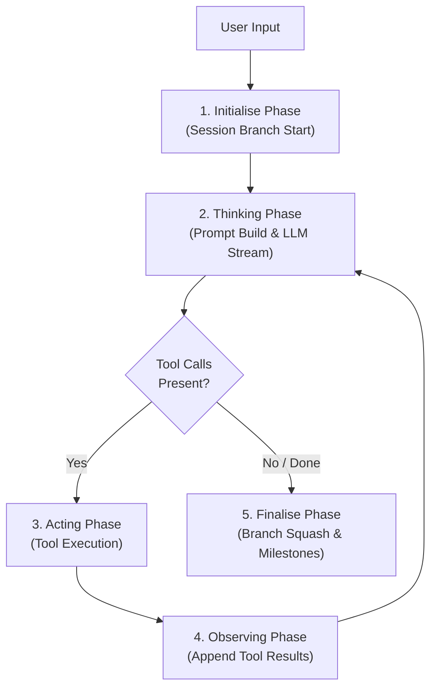

# Wayfare Architecture & Design Guidelines

This document outlines the core architectural principles, design patterns, and coding standards used across the Wayfare codebase. Follow these guidelines when extending or modifying the codebase to maintain simplicity, high readability, and effortless navigability.

---

## 1. Core Engineering Philosophy

Wayfare is designed around four foundational qualities:

1. **High Navigability**: A developer inspecting the codebase for the first time should understand the overall application lifecycle in under 30 seconds.
2. **Single-Responsibility Phases**: Each phase in a workflow operates as a pure data transformation without tight coupling to adjacent phases.
3. **Early Boundary Guards**: Public entry points validate inputs and state upfront, guaranteeing that internal methods execute in a valid state.
4. **Zero-Noise Internal Helpers**: Private helper methods perform direct, focused tasks without repetitive defensive assertions or redundant null checks.

---

## 2. Linear Data Flow Pipeline

Wayfare processes agent cycles through a strict 5-stage pipeline:



### Phase Breakdown

1. **Initialise Phase**: Receives raw user input, starts a new conversation branch in `Session`, and transitions state to `Thinking`.
2. **Thinking Phase**: Constructs `SessionMessage` prompts from session history, streams tokens from the LLM (`IChatClient`), and assembles content or `ToolCall` requests.
3. **Acting Phase**: Dispatches tool invocations in parallel to `ITool` instances registered in `ToolManager`.
4. **Observing Phase**: Records tool execution results (`ToolExecutionResult`) back into the `Session` AST and loops back to `Thinking`.
5. **Finalise Phase**: Squashes completed branch turns into a concise STARL milestone (`BranchSquasher`) and emits a `CycleCompletedEvent`.

---

## 3. Early Boundary Guards Pattern

Place all argument validation and state invariant checks as far up the call stack as possible—at public API entry points.

### Guidelines

- Use standard .NET guard methods (`ArgumentException.ThrowIfNullOrWhiteSpace`, `ArgumentNullException.ThrowIfNull`).
- Throw explicit exceptions (`InvalidOperationException`, `ArgumentException`) immediately when preconditions are violated.
- Never let invalid states pass by quietly or fail silently.

### Example: Public Boundary Guard

```csharp
public async Task RunCycleAsync(string userInput, CancellationToken cancellationToken)
{
    // Early guard check at entry point
    ArgumentException.ThrowIfNullOrWhiteSpace(userInput);

    await InitialiseCycleAsync(userInput, cancellationToken);
    // ...
}
```

```csharp
public IReadOnlyList<SessionMessage> BuildMessages(IReadOnlyList<ITool> tools, IReadOnlyList<HistoryNode> history)
{
    // Early guard checks at entry point
    ArgumentNullException.ThrowIfNull(tools);
    ArgumentNullException.ThrowIfNull(history);

    if (history.Count == 0 || history[^1] is not BranchNode activeBranch)
    {
        throw new InvalidOperationException($"Session history must contain at least one {nameof(BranchNode)}.");
    }
    
    // ...
}
```

---

## 4. Zero-Noise Helper Methods

Because public boundary methods guarantee valid state, private internal helpers should assume valid invariants.

### Guidelines

- Keep private helper methods short (5–15 lines).
- Avoid repeating defensive checks (`if (obj != null)` or type assertions) inside helpers when upper layers already validated them.
- Use C# pattern-matching expressions and LINQ for clear, declarative transformations.

### Example: Zero-Noise Helper

```csharp
// Assumes history[0] and history[^1] are valid BranchNodes (guaranteed by BuildMessages entry guard)
private static string BuildLinearTrunk(IReadOnlyList<HistoryNode> history)
{
    BranchNode firstBranch = (BranchNode)history[0];
    UserMessage firstUserMessage = (UserMessage)firstBranch.Turns[0].Message;

    StringBuilder trunk = new();
    trunk.AppendLine($"Objective: {firstUserMessage.Content}");
    trunk.AppendLine("\nMilestones:");

    for (int i = 0; i < history.Count - 1; i++)
    {
        BranchNode branch = (BranchNode)history[i];
        trunk.AppendLine($"{i + 1}. [{branch.Id}]: {branch.Summary}");
    }

    trunk.AppendLine("\nNote: Past turns are squashed into milestones.");
    return trunk.ToString();
}
```

---

## 5. Null Safety & Error Reporting Standards

### Null Safety Rules

- Avoid unnecessary `string?` parameters or record properties.
- Use default empty string values (`string Path = ""`, `string Command = ""`) in DTOs and argument records.
- Prefer non-nullable collection types (`IReadOnlyList<string>`, `HashSet<string>`).

### Error Reporting Standards

- **Fail-Fast Startup**: If application configuration (`Settings`) or tool loading (`ToolManager`) fails during startup, print detailed diagnostic messages to `Console.Error` and exit immediately with a non-zero exit code.
- **Never Pass Quietly**: Never swallow exceptions silently or return dummy fallback values when an invalid state occurs.

```csharp
// Program.cs startup error handler
if (toolManager.Errors.Count > 0)
{
    foreach (Exception error in toolManager.Errors)
    {
        Console.Error.WriteLine($"Tool initialization failed: {error.Message}");
    }
    Environment.ExitCode = 1;
    return;
}
```

---

## 6. Dynamic Tool Engineering (`ITool`)

Tools in Wayfare are self-contained plugins implementing `ITool`.

### Tool Guidelines

1. **Sealed Classes**: Implement tools as `internal sealed class ToolName(IToolHelpers toolHelpers) : ITool`.
2. **Safe Invocation Messages**: `GetInvocationMessage(string arguments)` must be non-throwing. Format display arguments safely using null-coalescing defaults if argument parsing fails.
3. **Structured Results**: Return clean `ToolExecutionResult` instances indicating success, display messages, output strings, and explicit error details.

### Example Tool Implementation

```csharp
internal sealed class WriteFileTool(IToolHelpers toolHelpers) : ITool
{
    public string Name => "write";
    public string DisplayName => "Write";
    public string Description => "Write content to a file. Parameters: path (string, required), content (string, required).";

    public string GetInvocationMessage(string arguments)
    {
        return toolHelpers.TryDeserializeArguments(arguments, out WriteFileArguments? args, out _)
            ? $"[{DisplayName}] [{args.Path}]"
            : $"[{DisplayName}] [{arguments}]";
    }

    public async Task<ToolExecutionResult> ExecuteAsync(string arguments, CancellationToken cancellationToken)
    {
        if (!toolHelpers.TryDeserializeArguments(arguments, out WriteFileArguments? args, out string? error))
        {
            return new ToolExecutionResult(false, "Failed to write file: invalid arguments.", string.Empty, error ?? "Invalid JSON");
        }

        if (!toolHelpers.TryGetRequiredPath(args.Path, out string? resolvedPath, out string? pathError))
        {
            return new ToolExecutionResult(false, $"Failed to write file: invalid path '{args.Path}'.", string.Empty, pathError ?? "Access denied");
        }

        try
        {
            toolHelpers.EnsureDirectoryExists(resolvedPath);
            await File.WriteAllTextAsync(resolvedPath, args.Content, cancellationToken);
            return new ToolExecutionResult(true, $"Wrote content to '{args.Path}'.", $"Successfully wrote to '{args.Path}'.", string.Empty);
        }
        catch (Exception ex)
        {
            return new ToolExecutionResult(false, $"Error writing to '{args.Path}'.", string.Empty, ex.Message, ex);
        }
    }

    internal record WriteFileArguments(string Path = "", string Content = "");
}
```
