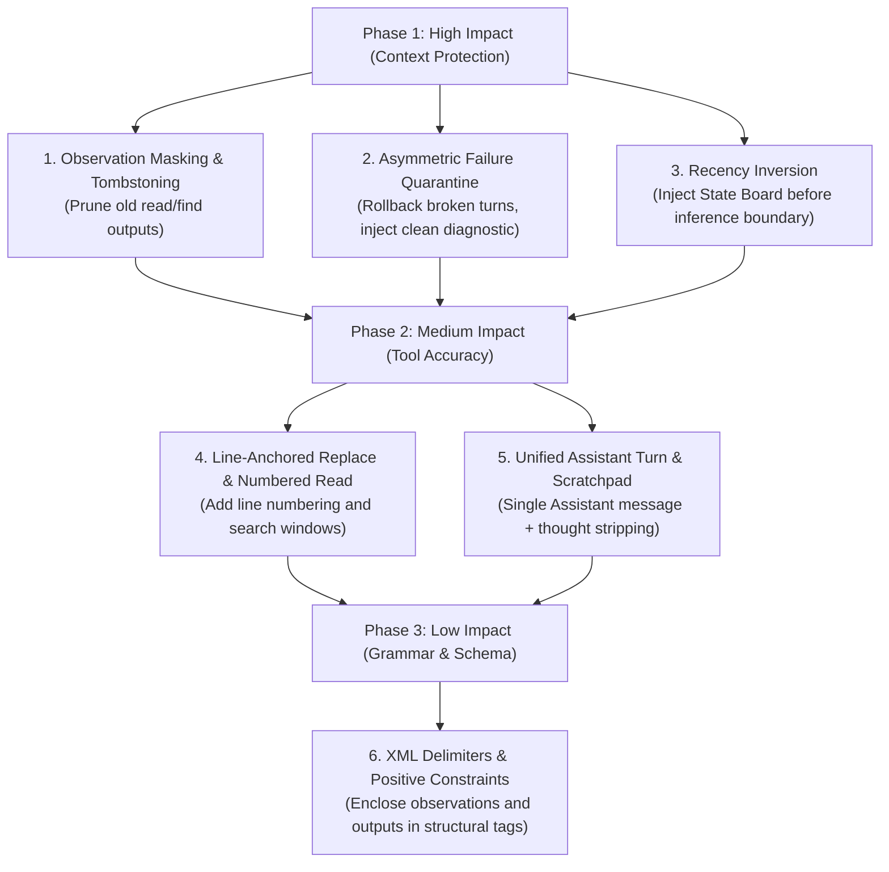

# Context Engineering Audit: Small-Model (7B–32B) Optimization

**Target Architecture:** Wayfare Agent Harness & Dynamic Tool Engine  
**Focus Models:** 7B–32B Parameter LLMs (e.g., Qwen 2.5 7B/14B/32B, Llama 3.1/3.3 8B/70B, Mistral/Devstral, Gemma 2 9B/27B)  
**Date:** August 2026  

---

## Executive Summary

Small models (7B–32B) operating in agentic coding harnesses face distinct failure modes compared to frontier models (>100B+):
1. **Rapid Context Saturation**: Slower token degradation curves and narrower effective attention spans make 2,000-line tool outputs disastrous.
2. **Attractor State & Error Cascades**: Accumulating failed generations and tool errors creates strong negative priors that trigger repeated loop failures.
3. **Lost-in-the-Middle Degradation**: Critical session intent and workspace state placed at the prompt head are forgotten after 3–5 tool iterations.
4. **Instruction Drift on Negative Constraints**: Negative prompts (*"Don't do X"*, *"No conversational filler"*) frequently induce the prohibited behavior.
5. **Brittle String Replacement**: Exact string replacement without line-number constraints fails due to whitespace hallucination and ambiguous matches.

This audit evaluates Wayfare against 6 small-model context engineering criteria, categorized by impact priority (**High**, **Medium**, **Low**), with exact file citations and drop-in refactoring blueprints.

---

## Findings Matrix

| # | Criterion | Impact Level | Primary Vulnerability | Core Files Affected |
|---|---|---|---|---|
| 1 | **Observation Masking & Tombstoning** | **HIGH** | Unbounded tool observations (2000-line file reads, unpaginated file tree scans) retained indefinitely in history; zero supersession tombstoning. | [`ReadFileTool.cs`](file:///home/dev/Wayfare/Tools/Implementations/ReadFileTool.cs), [`FindTool.cs`](file:///home/dev/Wayfare/Tools/Implementations/FindTool.cs), [`Prompts.cs`](file:///home/dev/Wayfare/Agent/Prompts.cs), [`OpenAIClient.cs`](file:///home/dev/Wayfare/Infrastructure/Clients/OpenAIClient.cs) |
| 2 | **Asymmetric Failure Quarantine** | **HIGH** | Broken tool calls and error messages are permanently appended to session AST, creating self-reinforcing error loops and context bloat. | [`Orchestrator.cs`](file:///home/dev/Wayfare/Agent/Orchestrator.cs), [`CircuitBreaker.cs`](file:///home/dev/Wayfare/Agent/CircuitBreaker.cs), [`Session.cs`](file:///home/dev/Wayfare/Session/Session.cs) |
| 3 | **Recency Inversion & State Management** | **HIGH** | Active Intent and Trunk Milestones are placed at the prompt head (index 1), getting buried by subsequent turns; no dynamic Blackboard at inference boundary. | [`Prompts.cs`](file:///home/dev/Wayfare/Agent/Prompts.cs), [`SessionModels.cs`](file:///home/dev/Wayfare/Session/SessionModels.cs), [`Session.cs`](file:///home/dev/Wayfare/Session/Session.cs) |
| 4 | **Tool Schema & Invariants** | **MEDIUM** | Replace tool lacks line-number anchoring; Read tool omits line numbers in output; schema definitions are redundantly duplicated in system prompt. | [`ReplaceTool.cs`](file:///home/dev/Wayfare/Tools/Implementations/ReplaceTool.cs), [`ReadFileTool.cs`](file:///home/dev/Wayfare/Tools/Implementations/ReadFileTool.cs), [`Prompts.cs`](file:///home/dev/Wayfare/Agent/Prompts.cs) |
| 5 | **Scratchpad & Compute Space** | **MEDIUM** | Split message turns (`AssistantMessage` + `ToolCallMessage`); unisolated reasoning traces persist across turns without compaction. | [`Orchestrator.cs`](file:///home/dev/Wayfare/Agent/Orchestrator.cs), [`OpenAIClient.cs`](file:///home/dev/Wayfare/Infrastructure/Clients/OpenAIClient.cs), [`Prompts.cs`](file:///home/dev/Wayfare/Agent/Prompts.cs) |
| 6 | **Structural Constraints & Output Delimiters** | **LOW / ARCH** | Heavy reliance on negative prompt constraints; unstandardized tool output framing and lack of XML boundary tags. | [`Prompts.cs`](file:///home/dev/Wayfare/Agent/Prompts.cs), [`BranchSquasher.cs`](file:///home/dev/Wayfare/Agent/BranchSquasher.cs), Tool Implementations |

---

# HIGH IMPACT FINDINGS

## 1. Observation Masking & Tombstoning (Criterion 2)

### Current Implementation Analysis
- **Unbounded Observation Bloat**: In [`ReadFileTool.cs`](file:///home/dev/Wayfare/Tools/Implementations/ReadFileTool.cs#L9-L16) and [`ReadFileTool.cs:L68`](file:///home/dev/Wayfare/Tools/Implementations/ReadFileTool.cs#L68), the default read limit is `limit = 2000` lines. A single read of a standard source file can inject 15,000–30,000 tokens into the session.
- **Unbounded Directory Search**: In [`FindTool.cs:L52`](file:///home/dev/Wayfare/Tools/Implementations/FindTool.cs#L52), `Directory.EnumerateFileSystemEntries` recursively crawls all subdirectories with `SearchOption.AllDirectories` and has no maximum result count, dumping hundreds of paths into context if broad patterns like `cs` or `json` are queried.
- **Zero Supersession Tombstoning**: In [`Prompts.cs:L77-L80`](file:///home/dev/Wayfare/Agent/Prompts.cs#L77-L80) and [`OpenAIClient.cs:L80-L101`](file:///home/dev/Wayfare/Infrastructure/Clients/OpenAIClient.cs#L80-L101), every previous tool output in `activeBranch.Turns` is preserved in full across all subsequent turns. When a file is read in Turn 1, modified in Turn 2, and read again in Turn 3, the stale Turn 1 read remains fully articulated in context.

### Exact Code Vulnerabilities
1. **[`Tools/Implementations/ReadFileTool.cs:L68`](file:///home/dev/Wayfare/Tools/Implementations/ReadFileTool.cs#L68)**:
   ```csharp
   internal record ReadFileArguments(string Path = "", int Offset = 0, int Limit = 2000);
   ```
2. **[`Tools/Implementations/FindTool.cs:L52-L68`](file:///home/dev/Wayfare/Tools/Implementations/FindTool.cs#L52-L68)**:
   ```csharp
   foreach (string entry in Directory.EnumerateFileSystemEntries(resolvedPath, "*", SearchOption.AllDirectories))
   // No limit, no ignore filters for bin/obj/.git
   ```
3. **[`Agent/Prompts.cs:L77-L80`](file:///home/dev/Wayfare/Agent/Prompts.cs#L77-L80)**:
   ```csharp
   foreach (TurnNode turn in activeBranch.Turns)
   {
       messages.Add(turn.Message); // Replays all raw historical observations verbatim
   }
   ```

### Proposed Refactoring Blueprint
1. **Set Sane Tool Limits & Truncation**: Cap default reads to 250 lines (or 8KB max), add exclusion filters (`.git`, `bin`, `obj`, `node_modules`) and a 50-entry cap to [`FindTool.cs`](file:///home/dev/Wayfare/Tools/Implementations/FindTool.cs).
2. **Tombstone Superseded Observations in Message Builder**: Mask past observations that have been superseded by subsequent actions on the same file/target.

```csharp
// Refactor in Agent/Prompts.cs: MessagePromptBuilder
public class MessagePromptBuilder : IMessagePromptBuilder
{
    private const int MaxActiveObservationsToRetain = 2; // Only keep the 2 most recent observations intact

    public IReadOnlyList<SessionMessage> BuildMessages(IReadOnlyList<ITool> tools, IReadOnlyList<HistoryNode> history, string intent)
    {
        // ... (system message and linear trunk)
        
        BranchNode activeBranch = (BranchNode)history[^1];
        List<TurnNode> turns = activeBranch.Turns;
        
        // Identify all ToolResult indices
        List<int> toolResultIndices = [];
        for (int i = 0; i < turns.Count; i++)
        {
            if (turns[i].Message is ToolResultMessage) toolResultIndices.Add(i);
        }

        // Indices older than the last N results should be tombstoned
        HashSet<int> indicesToTombstone = toolResultIndices
            .Take(Math.Max(0, toolResultIndices.Count - MaxActiveObservationsToRetain))
            .ToHashSet();

        for (int i = 0; i < turns.Count; i++)
        {
            SessionMessage msg = turns[i].Message;
            if (indicesToTombstone.Contains(i) && msg is ToolResultMessage resultMsg)
            {
                // Tombstone superseded observation
                var tombstonedResults = resultMsg.Results.Select(r => r with
                {
                    Result = $"[Observation tombstoned: {r.ToolName} output ({r.Result.Length} chars) compacted to save context.]",
                    DisplayMessage = "[Compacted historical observation]"
                }).ToList();

                messages.Add(new ToolResultMessage(tombstonedResults));
            }
            else
            {
                messages.Add(msg);
            }
        }

        return messages.AsReadOnly();
    }
}
```

---

## 2. Asymmetric Failure Quarantine (Criterion 4)

### Current Implementation Analysis
- **Error Accumulation in History**: In [`Orchestrator.cs:L159`](file:///home/dev/Wayfare/Agent/Orchestrator.cs#L159) and [`Orchestrator.cs:L225`](file:///home/dev/Wayfare/Agent/Orchestrator.cs#L225), when a model generates a hallucinated tool call, invalid JSON, or a failing command, the harness commits both the broken `ToolCallMessage` and the error `ToolResultMessage` to `_session.History`.
- **Feedback Loop Amplification**: In [`CircuitBreaker.cs:L31-L45`](file:///home/dev/Wayfare/Agent/CircuitBreaker.cs#L31-L45), repeated failed calls trigger a long diagnostic loop error message which is also appended to history.
- **Impact on 7B–32B Models**: Small models have high attention sensitivity to preceding turns. Seeing 2–3 consecutive failed tool calls primes the model to output variations of the same failure mode (negative attractor state), rather than backing up and attempting a clean alternative.

### Exact Code Vulnerabilities
1. **[`Agent/Orchestrator.cs:L156-L168`](file:///home/dev/Wayfare/Agent/Orchestrator.cs#L156-L168)**:
   ```csharp
   _session.AppendTurn(new ToolCallMessage(toolCalls)); // Unconditionally committed
   ```
2. **[`Agent/Orchestrator.cs:L220-L229`](file:///home/dev/Wayfare/Agent/Orchestrator.cs#L220-L229)**:
   ```csharp
   _session.AppendTurn(new ToolResultMessage(toolResults)); // Errors accumulate in history forever
   ```

### Proposed Refactoring Blueprint
Implement **Transient Failure Quarantine**:
- When a tool execution fails (or syntax check fails), do not accumulate the broken exchange into the persistent history.
- Quarantine the failed turn: rollback the failed `ToolCallMessage` and replace it with a single, compact `DiagnosticRecoveryMessage` prompting a fresh attempt.

```csharp
// Session/ISession.cs & Session/Session.cs
public interface ISession
{
    // ...
    void RollbackLastTurns(int count);
    void ReplaceLastTurn(SessionMessage newMessage);
}

// In Agent/Orchestrator.cs: ExecuteObservingPhaseAsync
private async Task ExecuteObservingPhaseAsync(
    IReadOnlyList<ToolCall> toolCalls,
    IReadOnlyList<ToolExecutionResult> toolResults,
    CancellationToken cancellationToken)
{
    bool anyFailure = toolResults.Any(r => !r.Success);

    if (anyFailure)
    {
        // ASYMMETRIC FAILURE QUARANTINE:
        // 1. Remove the broken ToolCallMessage added during Acting phase
        _session.RollbackLastTurns(1);

        // 2. Format a single clean diagnostic corrective prompt
        string diagnostic = string.Join("\n", toolResults
            .Where(r => !r.Success)
            .Select(r => $"Diagnostic: Tool '{r.ToolName}' failed: {r.Error}. Verify parameters and file contents before retrying."));

        // 3. Inject clean system recovery instruction instead of accumulating corrupted turns
        _session.AppendTurn(new UserMessage($"[Action Failed]\n{diagnostic}\nPlease correct your call or try an alternative strategy."));
        await sessionStore.SaveAsync(cancellationToken);
        _session.TransitionTo(SessionState.Thinking);
        return;
    }

    _session.TransitionTo(SessionState.Observing);
    _session.AppendTurn(new ToolResultMessage(toolResults));
    await sessionStore.SaveAsync(cancellationToken);
    _session.TransitionTo(SessionState.Thinking);
}
```

---

## 3. Recency Inversion & State Management (Criterion 5)

### Current Implementation Analysis
- **Goal Decay via Prompt Head Placement**: In [`Prompts.cs:L62-L82`](file:///home/dev/Wayfare/Agent/Prompts.cs#L62-L82), the active goal and linear trunk milestones are inserted at message index 1 (immediately after the system prompt):
  ```
  [0] SystemMessage
  [1] UserMessage (### Active Intent ... Milestones ...)
  [2] AssistantMessage ("Acknowledged...")
  [3..N] Turns (User, Assistant, ToolCall, ToolResult...)
  ```
- **Inference Boundary Amnesia**: As the agent works through 5–10 turns, the active intent is pushed 10,000+ tokens away from the inference generation point. 7B–32B models suffer severe *Lost-in-the-Middle* degradation, leading to goal wandering and tool looping.
- **No Workspace Blackboard**: There is no deterministic State Board (tracking modified files, discovered paths, active sub-task) injected right before the final turn.

### Exact Code Vulnerabilities
1. **[`Agent/Prompts.cs:L62-L82`](file:///home/dev/Wayfare/Agent/Prompts.cs#L62-L82)**:
   ```csharp
   if (history.Count > 1)
   {
       messages.Add(new UserMessage(BuildLinearTrunk(history, intent, activeBranch.Id)));
       messages.Add(new AssistantMessage("Acknowledged completed milestones..."));
   }
   // All turns appended after this, burying intent
   ```

### Proposed Refactoring Blueprint
Implement **Recency Inversion via Blackboard State Board**:
- Position the active intent, current objective, and dynamic workspace facts in a **State Board** right before the inference boundary (immediately preceding the latest turn).

```csharp
// Agent/Prompts.cs: MessagePromptBuilder
public class MessagePromptBuilder : IMessagePromptBuilder
{
    public IReadOnlyList<SessionMessage> BuildMessages(
        IReadOnlyList<ITool> tools,
        IReadOnlyList<HistoryNode> history,
        string intent,
        WorkspaceStateBoard stateBoard) // Injected deterministic state board
    {
        BranchNode activeBranch = (BranchNode)history[^1];
        List<SessionMessage> messages = [new SystemMessage(SystemPromptBuilder.Build(tools))];

        // 1. Append past turn history (compacted)
        foreach (TurnNode turn in activeBranch.Turns)
        {
            messages.Add(turn.Message);
        }

        // 2. RECENCY INVERSION: Inject State Board immediately before the generation boundary
        string stateBoardContent = $"""
        <state_board>
        Active Goal: {(string.IsNullOrWhiteSpace(intent) ? "Execute requested action" : intent)}
        Working Directory: {Directory.GetCurrentDirectory()}
        Modified Files: {(stateBoard.ModifiedFiles.Count > 0 ? string.Join(", ", stateBoard.ModifiedFiles) : "None")}
        Known Context: {stateBoard.ContextSummary}
        </state_board>
        """;

        messages.Add(new UserMessage(stateBoardContent));

        return messages.AsReadOnly();
    }
}
```

---

# MEDIUM IMPACT FINDINGS

## 4. Tool Schema & Invariants (Criterion 1)

### Current Implementation Analysis
- **Unanchored Exact String Replacement**: In [`ReplaceTool.cs:L56-L68`](file:///home/dev/Wayfare/Tools/Implementations/ReplaceTool.cs#L56-L68), `replace` uses whole-file substring matching (`normalisedContent.IndexOf(normalisedOldText)`). If `oldText` occurs more than once, it fails and tells the model to add surrounding lines. For 7B–32B models, generating 20+ lines of exact context invites indentation hallucinations and multi-line whitespace mismatches.
- **Missing Line Numbering in Read Output**: In [`ReadFileTool.cs:L58`](file:///home/dev/Wayfare/Tools/Implementations/ReadFileTool.cs#L58), `read` outputs raw lines without line numbers (`string.Join(Environment.NewLine, lineSlice)`). The model has to manually count lines from the `Offset`, leading to off-by-one errors when planning edits.
- **Redundant System Prompt Schemas**: In [`Prompts.cs:L19-L36`](file:///home/dev/Wayfare/Agent/Prompts.cs#L19-L36), the system prompt manually lists tool descriptions and usage rules, duplicating the JSON function schemas already registered in [`OpenAIClient.cs:L74`](file:///home/dev/Wayfare/Infrastructure/Clients/OpenAIClient.cs#L74).

### Exact Code Vulnerabilities
1. **[`Tools/Implementations/ReplaceTool.cs:L11-L16`](file:///home/dev/Wayfare/Tools/Implementations/ReplaceTool.cs#L11-L16)** & **[`L56-L68`](file:///home/dev/Wayfare/Tools/Implementations/ReplaceTool.cs#L56-L68)**:
   ```csharp
   ["path"] = ToolPropertySchema.String("The path of the file to edit."),
   ["oldText"] = ToolPropertySchema.String("The exact block of text to replace..."),
   ["newText"] = ToolPropertySchema.String("The replacement text...")
   // Lacks start_line and end_line bounds!
   ```
2. **[`Tools/Implementations/ReadFileTool.cs:L58`](file:///home/dev/Wayfare/Tools/Implementations/ReadFileTool.cs#L58)**:
   ```csharp
   string result = $"[File: ...]{Environment.NewLine}{string.Join(Environment.NewLine, lineSlice)}";
   // Missing line number prefixes (e.g., "12 | var x = 1;")
   ```
3. **[`Agent/Prompts.cs:L19-L25`](file:///home/dev/Wayfare/Agent/Prompts.cs#L19-L25)**:
   ```csharp
   foreach (ITool tool in tools)
   {
       promptBuilder.AppendLine($"- {tool.Name}: {tool.Description}"); // Redundant token waste
   }
   ```

### Proposed Refactoring Blueprint
1. **Add Line Number Prefixes to `ReadFileTool`**:
   ```csharp
   // Tools/Implementations/ReadFileTool.cs
   var numberedLines = lineSlice.Select((line, index) => $"{readFileArguments.Offset + index + 1,5} | {line}");
   string result = $"[File: {readFileArguments.Path}, Lines {readFileArguments.Offset + 1}-{readFileArguments.Offset + lineSlice.Length} of {lines.Length}]{Environment.NewLine}{string.Join(Environment.NewLine, numberedLines)}";
   ```
2. **Add Line Range Anchors to `ReplaceTool`**:
   ```csharp
   // Tools/Implementations/ReplaceTool.cs
   public ToolSchema Parameters => ToolSchema.Object(new Dictionary<string, ToolPropertySchema>
   {
       ["path"] = ToolPropertySchema.String("The path of the file to edit."),
       ["oldText"] = ToolPropertySchema.String("The exact text to replace."),
       ["newText"] = ToolPropertySchema.String("The replacement text."),
       ["startLine"] = ToolPropertySchema.Integer("Optional 1-based start line of search window (default 1)."),
       ["endLine"] = ToolPropertySchema.Integer("Optional 1-based end line of search window (default end of file).")
   }, required: ["path", "oldText", "newText"]);
   ```

---

## 5. Scratchpad & Compute Space (Criterion 3)

### Current Implementation Analysis
- **Turn Fragmentation**: In [`Orchestrator.cs:L143-L159`](file:///home/dev/Wayfare/Agent/Orchestrator.cs#L143-L159), when the model generates thinking text alongside a tool call, Wayfare appends two separate turns:
  1. `AssistantMessage(assembledContent)`
  2. `ToolCallMessage(toolCalls)`
- **OpenAI Protocol Mismatch**: In [`OpenAIClient.cs:L90-L91`](file:///home/dev/Wayfare/Infrastructure/Clients/OpenAIClient.cs#L90-L91), this generates two adjacent assistant messages (`AssistantChatMessage(content)` followed by `AssistantChatMessage(tool_calls)`). In OpenAI API specifications, content and tool calls for a single turn should be unified in a single message object.
- **Unbounded Reasoning Accumulation**: Raw thinking traces from turn $N-5$ remain in the prompt context throughout the cycle, consuming tokens and causing 7B models to fixate on stale hypotheses.

### Exact Code Vulnerabilities
1. **[`Agent/Orchestrator.cs:L143-L159`](file:///home/dev/Wayfare/Agent/Orchestrator.cs#L143-L159)**:
   ```csharp
   AssistantMessage assistantMessage = new(assembledContent.ToString());
   _session.AppendTurn(assistantMessage);
   // ...
   _session.AppendTurn(new ToolCallMessage(toolCalls));
   ```
2. **[`Infrastructure/Clients/OpenAIClient.cs:L90-L91`](file:///home/dev/Wayfare/Infrastructure/Clients/OpenAIClient.cs#L90-L91)**:
   ```csharp
   AssistantMessage message => [new AssistantChatMessage(message.Content)],
   ToolCallMessage message => [new AssistantChatMessage(message.ToolCalls.Select(...))],
   ```

### Proposed Refactoring Blueprint
1. **Unify Assistant Content and Tool Calls into a Single Turn Model**:
   ```csharp
   // Session/SessionModels.cs
   public record AssistantTurnMessage(string? Content, IReadOnlyList<ToolCall>? ToolCalls) : SessionMessage;
   ```
2. **Strip Historical Thoughts Older Than Turn $N-1$**:
   ```csharp
   // In Agent/Prompts.cs: MessagePromptBuilder
   // When mapping past assistant turns, if turn is not the immediately preceding turn,
   // strip <thought>...</thought> tags or empty the raw thinking content.
   ```

---

# LOW / ARCHITECTURAL IMPACT FINDINGS

## 6. Structural Constraints & Output Delimiters (Criterion 6)

### Current Implementation Analysis
- **Negative Prompt Formulation**: In [`Prompts.cs:L128-L131`](file:///home/dev/Wayfare/Agent/Prompts.cs#L128-L131) and [`Prompts.cs:L162-L166`](file:///home/dev/Wayfare/Agent/Prompts.cs#L162-L166), prompts instruct:
  - *"Output ONLY the goal text without any labels, introductory, or concluding remarks."*
  - *"No conversational filler, intros, or outros."*
  Small models (e.g. 7B) have lower negative instruction following and frequently emit preamble phrases like *"Here is the goal:"*.
- **Unstructured Observation Delimiters**: Tool results use loose bracketed strings (`[File: ...]`, `Directory entries in ...`, `Found 3 match(es)`), making it difficult for small models to reliably differentiate harness metadata from file content.

### Exact Code Vulnerabilities
1. **[`Agent/Prompts.cs:L128-L131`](file:///home/dev/Wayfare/Agent/Prompts.cs#L128-L131)** & **[`L162-L166`](file:///home/dev/Wayfare/Agent/Prompts.cs#L162-L166)**:
   Negative constraint formulations.
2. **[`Tools/Implementations/ListTool.cs:L61`](file:///home/dev/Wayfare/Tools/Implementations/ListTool.cs#L61)** & **[`FindTool.cs:L67`](file:///home/dev/Wayfare/Tools/Implementations/FindTool.cs#L67)**:
   Inconsistent observation framing.

### Proposed Refactoring Blueprint
- Convert negative constraints to **positive XML structural enclosures**.
- Standardize all tool results into `<observation name="...">...</observation>` envelopes.

```csharp
// Agent/Prompts.cs: IntentPromptBuilder
public static class IntentPromptBuilder
{
    public static string BuildSystem() => """
        You are a concise intent extractor.
        Extract the active goal from the user input and output it strictly inside <goal>...</goal> tags.
        Example:
        <goal>Fix null reference exception in SessionStore.cs</goal>
        """;
}

// Standardized Tool Result Wrapping in Infrastructure/Clients/OpenAIClient.cs
private static string FormatToolResultObservation(ToolExecutionResult result)
{
    string status = result.Success ? "success" : "error";
    string body = result.Success ? result.Result : result.Error;
    return $"<observation tool=\"{result.ToolName}\" status=\"{status}\">\n{body}\n</observation>";
}
```

---

## Action Plan & Implementation Roadmap



---

### Priority Implementation Checklist

- [ ] **Step 1: Cap Observation Limits**: Reduce `ReadFileTool` default `limit` to 250 lines, add 50-entry cap to `FindTool`, exclude `bin/obj/.git`.
- [ ] **Step 2: Observation Tombstoning**: In `MessagePromptBuilder`, replace historical tool results older than the last 2 turns with compact tombstone summaries.
- [ ] **Step 3: Asymmetric Failure Quarantine**: In `Orchestrator`, remove failing `ToolCallMessage` from history and inject a single clean diagnostic prompt.
- [ ] **Step 4: Recency Inversion**: Move active goal and dynamic workspace facts from prompt index 1 to a `<state_board>` placed right before the inference boundary.
- [ ] **Step 5: Numbered Read & Range Replace**: Add line number prefixes to `ReadFileTool` output (`12 | code`) and optional `startLine`/`endLine` to `ReplaceTool`.
- [ ] **Step 6: Unified Assistant Message**: Merge `AssistantMessage` and `ToolCallMessage` into a single turn record to avoid duplicate assistant messages in `OpenAIClient`.
- [ ] **Step 7: Positive XML Constraints**: Replace negative prompts with `<goal>`, `<thought>`, `<observation>` tags.
