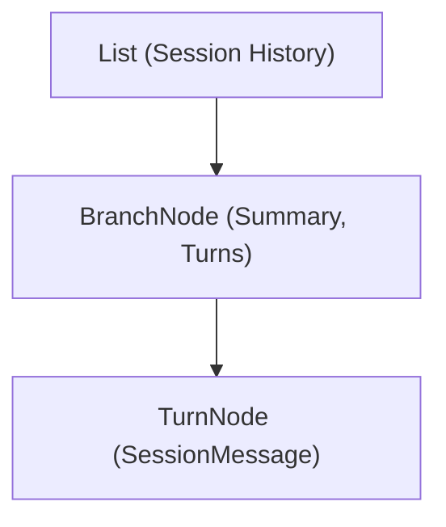

# WAYFARE // SOLAR BIOSPHERE v3.5

> High-performance .NET 10 terminal-based AI coding assistant harness powered by Chlorophyll OS & VerdantAgent, an Abstract Syntax Tree (AST) Context model, dynamic Roslyn tool engine, and event-driven ReAct execution loop.

---

## Architecture Overview

`Wayfare` organises conversation history into a structured **AST Context** model. Instead of feeding flat unorganised message logs to the LLM, `Wayfare` structures interaction history into explicit branches and discrete turn nodes.



### Key Architectural Pillars

1. **Pure Domain AST Entities ([`Session/SessionModels.cs`](Session/SessionModels.cs)):**
   - [`HistoryNode`](Session/SessionModels.cs): Abstract base record with polymorphic JSON serialisation attributes (`[JsonPolymorphic]`, `[JsonDerivedType]`).
   - [`BranchNode`](Session/SessionModels.cs): Active working branch representing live tool execution turns and squashed milestone summaries.
   - [`TurnNode`](Session/SessionModels.cs): Leaf node wrapping discrete domain messages (`UserMessage`, `AssistantMessage`, `ToolCallMessage`, `ToolResultMessage`).

2. **Context Engineering ([`Agent/Prompts.cs`](Agent/Prompts.cs)):**
   - **Positive XML Framing**: Replaces fragile negative prompt constraints with structured XML boundary markers (`<goal>`, `<milestone_summary>`, `<observation>`).

3. **Branch Squashing ([`Agent/BranchSquasher.cs`](Agent/BranchSquasher.cs) & [`Agent/Prompts.cs`](Agent/Prompts.cs)):**
   - Summarises completed active branches into STARL format (Situation, Task, Action, Result, Learnings) checkpoints inside `<milestone_summary>` tags to prevent prompt token bloat while keeping linear milestones intact.

4. **Dynamic Roslyn Tool Engine ([`Tools/ToolManager.cs`](Tools/ToolManager.cs)):**
   - Compiles tool implementations (`Tools/Implementations/*.cs`) at runtime using Roslyn.
   - Includes metadata references for `System.Text.Json`, `Wayfare.Tools`, and `Wayfare.Infrastructure.Configuration`.

5. **Architecture & Design Standards ([`ARCHITECTURE.md`](ARCHITECTURE.md) & [`PRINCIPLES.md`](PRINCIPLES.md)):**
   - Detailed design guidelines covering early boundary guards, linear data flow, zero-noise helper methods, null safety, and tool implementation rules.

---

## Repository Structure

```
Wayfare/
├── Program.cs                                 // Composition root & top-level REPL loop
├── Infrastructure/
│   ├── Configuration/Settings.cs              // Environment configuration & validation
│   ├── AI/                                    // MEAI streaming contracts, mappers & reasoning content
│   │   ├── ChatModels.cs                      // ToolCall DTO
│   │   ├── ReasoningContent.cs                // AIContent representation for reasoning tokens
│   │   ├── SessionMessageMapper.cs            // SessionMessage to ChatMessage converter
│   │   └── ToolMapper.cs                      // ITool to AIFunction / AITool mapper
│   ├── Clients/                               // Chat client decorators & adapters
│   │   └── OpenAIClient.cs                    // DelegatingChatClient for OpenAI reasoning extraction
│   └── Events/                                // Channel-based event broker & event records
│       ├── Events.cs
│       └── EventBroker.cs
├── Session/                                   // In-memory AST, turns, and async disk persistence
│   ├── ISession.cs
│   ├── Session.cs
│   ├── SessionModels.cs
│   └── SessionStore.cs
├── Tools/                                     // Dynamic Roslyn compiler & built-in tool plugins
│   ├── ITool.cs
│   ├── ToolManager.cs
│   ├── ToolHelpers.cs
│   └── Implementations/
│       ├── InspectMilestoneTool.cs
│       ├── ExecuteCommandTool.cs
│       ├── FindTool.cs
│       ├── ListTool.cs
│       ├── ReadFileTool.cs
│       ├── ReplaceTool.cs
│       └── WriteFileTool.cs
├── Agent/                                     // 5-phase orchestration pipeline & prompt builders
│   ├── AgentModels.cs
│   ├── Orchestrator.cs
│   ├── IntentResolver.cs
│   ├── PivotDetector.cs
│   ├── BranchSquasher.cs
│   ├── CircuitBreaker.cs                      // Loop detection & repetition breaker strategy
│   └── Prompts.cs
└── UI/                                        // Solarpunk terminal interface & Spectre renderers
    ├── ITerminalUI.cs
    ├── TerminalUI.cs
    ├── ColourPalette.cs
    └── Components/
        ├── MarkdownStreamRenderer.cs
        ├── ProgressRenderer.cs
        └── ThinkingStreamRenderer.cs
```

---

## Built-in Tools

| Tool | Name | Description | Output Format & Invariants |
| :--- | :--- | :--- | :--- |
| **Read File** | `read` | Read line range from file (`path`, `offset`, `limit`). Default limit is 200 lines. | Formatted with 1-indexed, right-aligned line numbers wrapped in `<observation tool="read_file" path="..." lines="..." total_lines="...">`. |
| **Write File** | `write` | Create new file or overwrite file content (`path`, `content`). | Structured result confirming written byte/line counts. |
| **Replace Content** | `replace` | Exact unique string replacement in file (`path`, `oldText`, `newText`, `startLine`, `endLine`). | Supports optional line search window bounds (`startLine`, `endLine`). Returns diagnostic errors wrapped in `<observation tool="replace" status="error">`. |
| **List Directory** | `list` | List contents of directory (`path`). | Filtered against excluded noise directories. |
| **Find Files** | `find` | Find files matching pattern (`path`, `pattern`). | Filtered by `Settings.ExcludedDirectories`, capped at 50 results with truncation note, wrapped in `<observation tool="find" ...>`. |
| **Execute Command** | `execute` | Run executable command in working directory (`command`, `arguments`). | Captured standard output and error streams. |
| **Inspect Milestone** | `inspect_milestone` | Inspect details and turns of a past milestone (`id`). | Detailed turns and summary of target squashed milestone. |

---

## Configuration & Setup

### Environment Variables (`.env`)

Create a `.env` file in the root directory:

```env
MODEL_NAME=MODEL_NAME
API_KEY=local-no-key-needed
ENDPOINT=http://127.0.0.1:8080/
TOOLS_PATH=/home/dev/Wayfare/Tools/Implementations
COMPILED_DIRECTORY=/home/dev/Wayfare/compiled
SESSIONS_DIRECTORY=/home/dev/Wayfare/sessions
MAX_TURNS=15
EXCLUDED_DIRECTORIES=.git,bin,obj,node_modules,.vs
```

| Variable | Required | Default | Description |
| :--- | :--- | :--- | :--- |
| `MODEL_NAME` | Yes | — | Name of LLM model to target. |
| `API_KEY` | Yes | — | API key or token for LLM endpoint. |
| `ENDPOINT` | Yes | — | Base HTTP URL of OpenAI-compatible API endpoint. |
| `TOOLS_PATH` | Yes | — | Directory path containing dynamic Roslyn tool implementations. |
| `COMPILED_DIRECTORY` | Yes | — | Directory path for cached Roslyn compiled tool DLLs. |
| `SESSIONS_DIRECTORY` | Yes | — | Directory path where session AST logs are persisted. |
| `MAX_TURNS` | No | `15` | Maximum ReAct loop iterations per user turn before circuit breaker triggers. |
| `EXCLUDED_DIRECTORIES` | No | `.git,bin,obj,node_modules,.vs` | Comma- or semicolon-separated directory names to ignore during file searches and path traversal. |

---

## Running & Building

### Build Solution
```bash
dotnet build Wayfare.slnx
```

### Run Application
```bash
dotnet run --project Wayfare.csproj
```

### Run Tests
```bash
dotnet test
```
