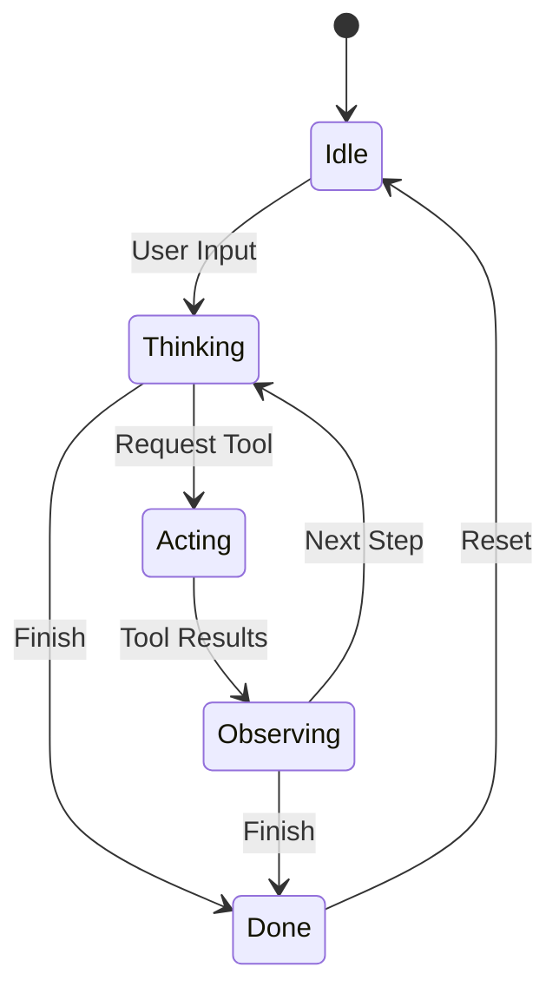

# Wayfare

Let's start out with a simple question: **What if a coding agent was built like a strict state machine, where instead of allowing the model to define the transitions we make it fixed and explicit?**

Wouldn't that allow for agentic workflows that are reproducible, easy to debug, and predictable?
This project explores the idea of a lightweight coding agent harness as an explicit state machine with pre-compiled tools.

The goal is to further my understand of what are the fundermentals of an coding agent harness and what future directions can I take to optimise one.

## Why?

I wanted a coding agent that is simple, deterministic, and predictable.

When you build an agent, you need two things:
1. **Control**: The agent should not wander into unexpected states. If it is thinking, it cannot claim it is observing. If it calls a tool, it cannot skip execution.
2. **Speed**: Waiting seconds for an agent to re-parse tool scripts every time you restart the process gets old quickly.

Wayfare addresses these issues with two specific design choices:

1. **The agent is an explicit state machine**. Transitions between thinking, acting, and observing are enforced in code. If a transition is invalid, it throws an exception immediately.
2. **Tools are compiled on disk for instant cold reloads**. On the first run, tool files are compiled. On every subsequent run, the agent loads the compiled binaries directly from disk.

## The State Machine

Some frameworks manage agent flow entirely inside prompt text. If the model gets confused, the loop breaks or drifts.

In Wayfare, the engine strictly enforces five states:

- `Idle`: Waiting for user input. Resets the context and system prompt.
- `Thinking`: The model processes the conversation, streams thoughts, and decides whether to stop or request tools.
- `Acting`: The agent dispatches tool calls. Tools execute in parallel tasks.
- `Observing`: The agent collects execution results and writes them back into the session history.
- `Done`: The model finished its task and returns control to the user.

If the agent tries to act when it is not in the `Thinking` state, the runtime catches it.



## Pre-Compiled Tools and Cold Reloads

Adding tools to an agent should feel like writing simple scripts, but running them should feel like native compiled binaries.

In Wayfare, each tool lives in its own `.cs` file in the `Tools` folder. When the application starts:

1. `ToolManager` inspects each tool file in the tools directory.
2. It checks whether a corresponding `.dll` exists in the compiled directory and compares file modification timestamps.
3. If the source file is new or modified, it compiles the file.
4. If the `.dll` already exists and is up to date, compilation is skipped entirely.
5. The compiled DLL is loaded into memory.
6. Stale DLLs for removed tools are automatically deleted.

This gives you the flexibility of standalone C# script files with the startup speed of pre-compiled binaries. After the initial build, cold starts load almost instantly.

## Built-in Tools

Wayfare ships with a minimal set of tools for inspecting and modifying codebases:

| Tool | Name | Description |
| --- | --- | --- |
| `read` | Read | Reads lines from a file with optional offset and limit. |
| `write` | Write | Creates a new file or completely overwrites an existing one. |
| `replace` | Replace | Performs exact string replacement. Requires matches to be unique. |
| `list` | List | Lists directory contents with optional depth limits. |
| `find` | Find | Searches files for text or regex patterns. |
| `execute` | Execute Command | Runs shell commands with subprocess timeout and process tree termination. |

## Architecture

Wayfare keeps components separated and easy to follow:

- **Engine**: Drives the turn cycle. Coordinates calls between the session, the chat client, and tool execution.
- **Session**: Manages the message history and guards state machine transitions.
- **ToolManager**: Handles Roslyn compilation, caching, and loading of tool assemblies.
- **OpenAIClient**: Communicates with any OpenAI-compatible endpoint using streaming chat completions.
- **AgentEventHub**: An asynchronous message broker backed by `System.Threading.Channels`.
- **TerminalUI**: Consumes events from the channel and renders a terminal interface with live markdown streaming via Spectre.Console.

## Future Directions

As models become more and more capable, the harnesses will requires less explicit instructions. It seems the current challenge is to manage the context and ensure only the relevent information is there at the right time.
How we can do that is still up to debate. I need to explore this further. 

## Quick Start

### Prerequisites

- [.NET 10 SDK](https://dotnet.microsoft.com/download)
- A local or remote OpenAI-compatible server (such as `llama-server`, Ollama, or vLLM)

### Setup

1. Clone the repository:
   ```bash
   git clone https://github.com/HuyNguyenAu/Wayfare.git
   cd Wayfare
   ```

2. Configure environment variables in `.env`:
   ```bash
   MODEL_NAME=your-model-name
   API_KEY=local-no-key-needed
   ENDPOINT=http://127.0.0.1:8080/
   TOOLS_PATH=./Tools
   ```

3. Start your local model server (for example, with `llama.cpp`):
   ```bash
   ./llama-server -m models/your-model.gguf --port 8080
   ```

4. Run Wayfare:
   ```bash
   dotnet run
   ```

## Acknowledgements

- [Spectre.Console](https://spectreconsole.net/) for the terminal interface.
- [Roslyn](https://github.com/dotnet/roslyn) for the dynamic C# compiler platform.
