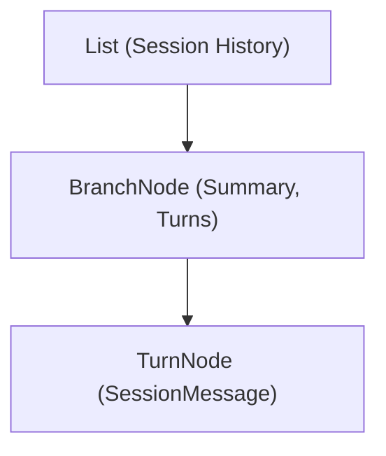

# WAYFARE // SOLAR PUNK SANCTUARY v1.0

> High-performance .NET 10 terminal-based AI coding assistant harness powered by an Abstract Syntax Tree (AST) Context model, dynamic Roslyn tool engine, and event-driven ReAct execution loop.

---

## Architecture Overview

`Wayfare` organizes conversation history into a structured **AST Context** model. Instead of feeding flat unorganized message logs to the LLM, `Wayfare` structures interaction history into explicit branches and discrete turn nodes.



### Key Architectural Pillars

1. **Pure Domain AST Entities (`Core/Models/Ast/`):**
   - [`HistoryNode`](Core/Models/Ast/HistoryNode.cs): Abstract base record with polymorphic JSON serialization attributes (`[JsonPolymorphic]`, `[JsonDerivedType]`).
   - [`BranchNode`](Core/Models/Ast/BranchNode.cs): Active working branch representing live tool execution turns and squashed milestone summaries.
   - [`TurnNode`](Core/Models/Ast/TurnNode.cs): Leaf node wrapping discrete domain messages (`UserMessage`, `AssistantMessage`, `ToolCallMessage`, `ToolResultMessage`).

2. **Branch Squashing (`Core/Orchestrator.cs` & `Core/Prompts/SquashPromptBuilder.cs`):**
   - Summarizes completed active branches into STARL format (Situation, Task, Action, Result, Learnings) checkpoints to prevent prompt token bloat while keeping linear milestones intact.

3. **Dynamic Roslyn Tool Engine (`Tools/ToolManager.cs`):**
   - Compiles tool implementations (`Tools/Implementations/*.cs`) at runtime using Roslyn.
   - Includes metadata references for `System.Text.Json` and `Wayfare.Core`.

4. **Architecture & Design Standards ([`ARCHITECTURE.md`](ARCHITECTURE.md)):**
   - Detailed design guidelines covering early boundary guards, linear data flow, zero-noise helper methods, null safety, and tool implementation rules.

---

## Repository Structure

```
Wayfare/
├── Core/
│   ├── Abstractions/             # Interfaces (ISession, ISessionStore, ITool, IChatClient)
│   ├── Events/                   # Domain & UI events (ToolExecutionStartedEvent, ChatRequestStartedEvent, etc.)
│   ├── Models/
│   │   ├── Ast/                  # HistoryNode, BranchNode, TurnNode
│   │   └── Messages/             # Polymorphic SessionMessage subtypes
│   ├── Prompts/                  # SystemPromptBuilder, SquashPromptBuilder
│   └── Orchestrator.cs           # Main ReAct loop & milestone squashing logic
├── Infrastructure/
│   ├── Clients/                  # OpenAIClient streaming implementation
│   ├── Configuration/            # Settings loader (.env parsing)
│   └── Events/                   # Channel-backed EventBroker
├── Persistence/
│   └── SessionStore.cs           # AST JSON persistence
├── Tools/
│   ├── Implementations/          # Dynamic tools (read, write, replace, list, find, exec)
│   ├── ToolHelpers.cs            # Argument deserialization & path validation helpers
│   └── ToolManager.cs            # Roslyn dynamic compiler & loader
├── UI/
│   ├── Components/               # ProgressRenderer & MarkdownStreamRenderer
│   └── TerminalUI.cs             # Event-driven Spectre.Console UI
├── Program.cs                    # Application entry point
├── Wayfare.csproj                # Main C# project configuration
└── Wayfare.slnx                  # Solution configuration
```

---

## Built-in Tools

| Tool | Name | Description |
| :--- | :--- | :--- |
| **Read File** | `read` | Read line range from file (`path`, `offset`, `limit`). |
| **Write File** | `write` | Create new file or overwrite file content (`path`, `content`). |
| **Replace Content** | `replace` | Exact string replacement in file (`path`, `oldText`, `newText`). |
| **List Directory** | `list` | List contents of directory (`path`). |
| **Find Files** | `find` | Find files matching pattern (`path`, `pattern`). |
| **Execute Command** | `exec` | Run shell command in current working directory (`command`). |

---

## Configuration & Setup

### Environment Variables (`.env`)

Create a `.env` file in the root directory:

```env
MODEL_NAME=MODEL_NAME
API_KEY=local-no-key-needed
ENDPOINT=http://127.0.0.1:8080/
TOOLS_PATH=/home/dev/Wayfare/Tools/Implementations
COMPILED_DIRECTORY=/home/dev/Wayfare/compiled
SESSIONS_DIRECTORY=/home/dev/Wayfare/sessions
```

---

## Running & Building

### Build Solution
```bash
dotnet build Wayfare.slnx
```

### Run Application
```bash
dotnet run --project Wayfare.csproj
```
