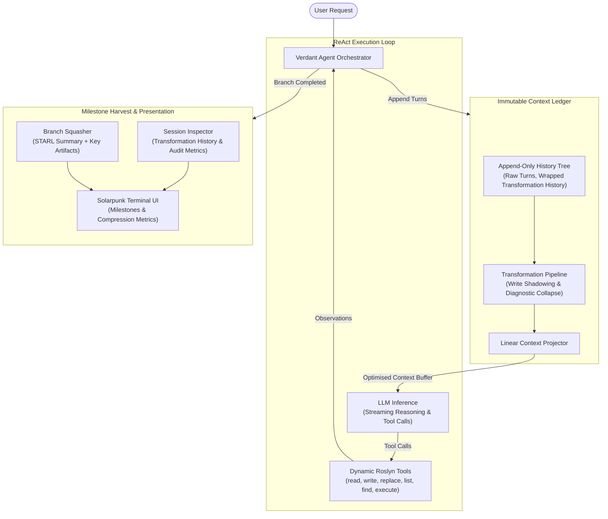

# WAYFARE // SOLAR BIOSPHERE v3.5

> High-performance .NET 10 terminal-based AI coding assistant harness powered by Chlorophyll OS & VerdantAgent, an **Immutable Context Ledger with Projection Transforms**, dynamic Roslyn tool engine, and event-driven ReAct execution loop.

---

## Architecture Overview

`Wayfare` structures interaction history into an **Immutable Context Ledger with Projection Transforms**. Instead of appending unorganised message logs to the LLM, `Wayfare` decouples conversation storage from inference context projection via an append-only tree topology, deterministic transformation pipeline, and linear context projector.



### Key Architectural Pillars

1. **Immutable Node Tree & Wrapped Transformation History ([`Session/SessionModels.cs`](Session/SessionModels.cs)):**
   - [`HistoryNode`](Session/SessionModels.cs): Abstract base record with polymorphic JSON serialisation attributes (`[JsonPolymorphic]`, `[JsonDerivedType]`), unique GUID v7 `Id`, UTC `CreatedAt`, and metadata.
   - [`TurnNode`](Session/SessionModels.cs): Leaf node holding an immutable conversational turn (`SessionMessage`).
   - [`SupersededStateNode`](Session/SessionModels.cs): Non-destructive wrapper enclosing a past node whose state was superseded by a subsequent write action, exposing a lightweight reference stub (`[Observation superseded by write to '{path}']`) while preserving the full target node across arbitrary nesting depth.
   - [`CollapsedExplorationNode`](Session/SessionModels.cs): Bundles a contiguous sequence of ephemeral exploratory turns (`list`, `find`, diagnostic commands) into a single consolidated transaction node.
   - [`BranchContainerNode`](Session/SessionModels.cs): Container encapsulating turns for active branches, ReAct iterations, and squashed milestone summaries.

2. **Deterministic Transformation Pipeline ([`Session/Transformations/`](Session/Transformations/)):**
   - **Write Shadowing (Superseded State Elimination)**: Scans write actions (`write`, `replace`), indexes mutated resources, and wraps past raw read/write observations in lightweight reference stubs.
   - **Diagnostic Collapse (Ephemeral Action Pruning)**: Categorises tool schemas into exploratory discovery versus persistent mutations, bundling preceding exploratory sequences upon completing terminal mutations.
   - **Transformation History & Identity Invariants**: Persistent unique Node IDs across all transformations and support for arbitrary wrapping depth.

3. **Linear Context Projector & Session Inspector ([`Session/Projection/`](Session/Projection/) & [`Session/Inspection/`](Session/Inspection/)):**
   - **Context Projector (`ISessionProjector`)**: Traverses the linear trunk and emits only the outermost active representation of each node into the LLM context buffer.
   - **Session Inspector (`ISessionInspector`)**: Recursively unwraps nested nodes to reconstruct full transformation histories and generates compression audit metrics.
   - **Automatic Post-Squash Audit Report**: Emits a Solarpunk-styled audit report in Chlorophyll OS after every branch squash displaying raw turns, projected turns, compression ratio, shadowed observations, and collapsed exploratory groups.

4. **Context Engineering & Milestone Squashing ([`Agent/Prompts.cs`](Agent/Prompts.cs) & [`Agent/BranchSquasher.cs`](Agent/BranchSquasher.cs)):**
   - **STARL + Key Artifacts Invariants**: Summarises completed active branches into STARL format (Situation, Task, Action, Result, Learnings) plus Key Artifacts (exact file paths, executed commands, and state guarantees) inside `<milestone_summary>` tags.

5. **Dynamic Roslyn Tool Engine ([`Tools/ToolManager.cs`](Tools/ToolManager.cs)):**
   - Compiles tool implementations (`Tools/Implementations/*.cs`) at runtime using Roslyn with seamed I/O boundaries.

---

## Repository Structure

```
Wayfare/
├── Program.cs                                 // Composition root & top-level REPL loop
├── Infrastructure/
│   ├── Configuration/Settings.cs              // Environment configuration & validation
│   ├── AI/                                    // MEAI streaming contracts, mappers & reasoning content
│   │   ├── ChatModels.cs                      // ToolCall DTO
│   │   ├── ReasoningContent.cs                // AIContent representation for reasoning tokens
│   │   ├── SessionMessageMapper.cs            // SessionMessage to ChatMessage converter
│   │   └── ToolMapper.cs                      // ITool to AIFunction / AITool mapper
│   ├── Clients/
│   │   └── OpenAIClient.cs                    // DelegatingChatClient for OpenAI reasoning extraction
│   └── Events/                                // Channel-based event broker & event records
│       ├── Events.cs                          // CycleCompletedEvent with SessionAuditReport
│       └── EventBroker.cs
├── Session/                                   // Immutable Context Ledger, Projection & Persistence
│   ├── ISession.cs                            // Session contract with LinearTrunk & Pipeline
│   ├── Session.cs                             // In-memory ledger implementation
│   ├── SessionModels.cs                       // HistoryNode polymorphic hierarchy & SessionMessages
│   ├── SessionStore.cs                        // Channel-backed async disk persistence
│   ├── Transformations/                       // Deterministic Transformation Pipeline
│   │   ├── ITransformationPipeline.cs
│   │   ├── TransformationPipeline.cs
│   │   ├── ResourceIndex.cs                   // Resource access index
│   │   ├── WriteShadowingRule.cs              // Superseded state elimination
│   │   └── DiagnosticCollapseRule.cs          // Ephemeral action pruning
│   ├── Projection/                            // Context projection for LLM inference
│   │   └── SessionProjector.cs                // Linear trunk context projector
│   └── Inspection/                            // Observability & transformation history traversal
│       └── SessionInspector.cs                // Recursive lineage unwrapping & audit metrics
├── Tools/                                     // Dynamic Roslyn compiler & built-in tool plugins
│   ├── ITool.cs
│   ├── ToolManager.cs
│   ├── ToolHelpers.cs
│   └── Implementations/
│       ├── ExecuteCommandTool.cs
│       ├── FindTool.cs
│       ├── InspectMilestoneTool.cs            // Inspects compressed milestone summaries & turns
│       ├── ListTool.cs
│       ├── ReadFileTool.cs
│       ├── ReplaceTool.cs
│       └── WriteFileTool.cs
├── Agent/                                     // 5-phase orchestration pipeline & prompt builders
│   ├── AgentModels.cs
│   ├── Orchestrator.cs                        // Core agent loop with post-squash audit report
│   ├── PivotDetector.cs
│   ├── BranchSquasher.cs
│   ├── CircuitBreaker.cs                      // Loop detection & repetition breaker strategy
│   └── Prompts.cs                             // Prompt builder using ISessionProjector
└── UI/                                        // Solarpunk terminal interface & Spectre renderers
    ├── ITerminalUI.cs
    ├── TerminalUI.cs
    ├── ColourPalette.cs
    └── Components/
        ├── MarkdownStreamRenderer.cs
        ├── ProgressRenderer.cs                // Harvested milestones & Solarpunk audit reporter
        └── ThinkingStreamRenderer.cs
```

---

## Built-in Tools

| Tool | Name | Description | Output Format & Invariants |
| :--- | :--- | :--- | :--- |
| **Read File** | `read` | Read line range from file (`path`, `offset`, `limit`). Default limit is 200 lines. | Formatted with 1-indexed, right-aligned line numbers wrapped in `<observation tool="read_file" path="..." lines="..." total_lines="...">`. |
| **Write File** | `write` | Create new file or overwrite file content (`path`, `content`). | Structured result confirming written byte/line counts. Triggers write shadowing on prior read/write observations. |
| **Replace Content** | `replace` | Exact unique string replacement in file (`path`, `oldText`, `newText`, `startLine`, `endLine`). | Supports optional line search window bounds (`startLine`, `endLine`). Triggers write shadowing on prior read/write observations. |
| **List Directory** | `list` | List contents of directory (`path`). | Filtered against excluded noise directories. Categorised as exploratory for diagnostic collapse. |
| **Find Files** | `find` | Find files matching pattern (`path`, `pattern`). | Filtered by `Settings.ExcludedDirectories`, capped at 50 results. Categorised as exploratory for diagnostic collapse. |
| **Execute Command** | `execute` | Run executable command in working directory (`command`, `arguments`). | Captured standard output and error streams. |
| **Inspect Milestone** | `inspect_milestone` | Inspect details and compressed turns of a past milestone (`id`). | Detailed compressed turns and summary of target squashed milestone. |

---

## Configuration & Setup

### Environment Variables (`.env`)

Create a `.env` file in the root directory:

```env
MODEL_NAME=MODEL_NAME
API_KEY=local-no-key-needed
ENDPOINT=http://127.0.0.1:8080/
TOOLS_PATH=/home/dev/Wayfare/Tools/Implementations
SESSIONS_DIRECTORY=/home/dev/Wayfare/sessions
MAX_TURNS=15
EXCLUDED_DIRECTORIES=.git,bin,obj,node_modules,.vs
```

| Variable | Required | Default | Description |
| :--- | :--- | :--- | :--- |
| `MODEL_NAME` | Yes | — | Name of LLM model to target. |
| `API_KEY` | Yes | — | API key or token for LLM endpoint. |
| `ENDPOINT` | Yes | — | Base HTTP URL of OpenAI-compatible API endpoint. |
| `TOOLS_PATH` | Yes | — | Directory path containing tool implementations. |
| `SESSIONS_DIRECTORY` | Yes | — | Directory path where session AST logs are persisted. |
| `MAX_TURNS` | No | `15` | Maximum ReAct loop iterations per user turn before circuit breaker triggers. |
| `EXCLUDED_DIRECTORIES` | No | `.git,bin,obj,node_modules,.vs` | Comma- or semicolon-separated directory names to ignore during file searches and path traversal. |

---

## Running & Building

### Build Solution
```bash
dotnet build Wayfare.slnx
```

### Run Application
```bash
dotnet run --project Wayfare.csproj
```

### Run Tests
```bash
dotnet test
```
